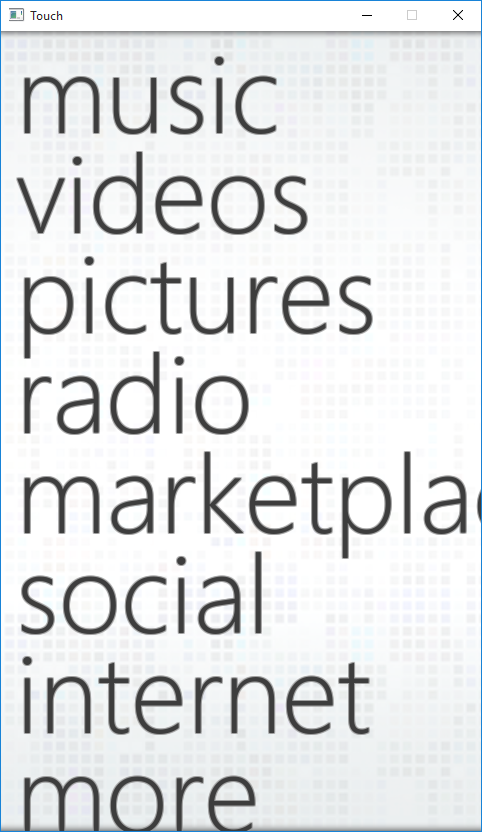

# Touch
My attempt to recreate the Microsoft Zune UI in Win32/OpenGL, back then I thought it looked really cool.

Wanted to experiment with graphically accelerated touch-screen based user interfaces but could not afford an actuall device so I decided to make this prototype for experimentation.

